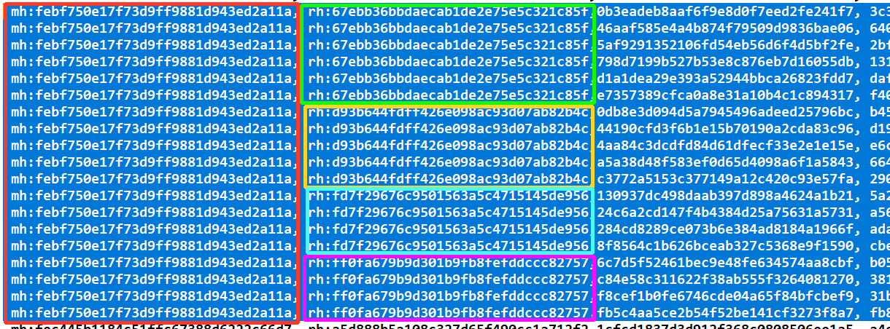

# MetaHash
Metahash (Hashed FileVersionInfo)

The Metahash is a product of concatenating the following FileVersionInfo strings (as is, no separators):
- CompanyName
- FileDescription
- InternalName
- LegalCopyright
- LegalTrademarks
- OriginalFilename
- ProductName

*Images showing Metahash, Richhash and conventional file hashes. Not all files have Richheaders or Filversioninfo though.*

Result is shown as:
- mh: MD5_HASH = File contains FileVersionInfo (at least one string)
- \- = Contains absolutely no FileVersionInfo strings.

Example CSV file (mh_rh_md5_sha1_sha256.csv) included in this folder.
Fields in CSV file:
- Metahash ("mh:")
- Richhash ("rh:", "nh:")
- MD5
- SHA1
- SHA256
