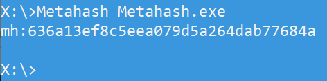

# MetaHash
Metahash (Hashed FileVersionInfo)

The Metahash is a product of concatenating the following FileVersionInfo strings (as is, no separators):
- CompanyName
- FileDescription
- InternalName
- LegalCopyright
- LegalTrademarks
- OriginalFilename
- ProductName

Metahashes have a bit less entropy and they can match more malware, but are also prone for false positives. Note that no version numbers are included in the hashing process (i.e. *FileVersion, ProductVersion, Assembly Version*).

*Image above showing Metahash (left), Richhash (middle) and conventional file hashes (right), showing relationships over other hashes. Please note that not all files have Richheaders or Filversioninfo though. Data shown is 4 different "strains" of Emotet, normally separated under the richhashes, but here the Metahash binds all 4 "strains" together.*

Result is shown as:
- mh: MD5_HASH = File contains FileVersionInfo (at least one string)
- \- = Contains absolutely no FileVersionInfo strings.

Example CSV file (**mh_rh_md5_sha1_sha256.csv**) included in this folder.
Fields in CSV file:
- Metahash ("mh:")
- Richhash ("rh:", "nh:")
- MD5
- SHA1
- SHA256

**Tool:** Metahash.zip

Usage: Metahash.exe FILENAME = produces a hash of Filversion info strings, i.e.:

**Hash-signatures for "Metahash.exe":**

- MD5: c1e47107a182380193db69378d5af084
- SHA1: 3d8ec9246f5a31fe2436b5167798a5c7a7452557
- SHA256: 7cfe164a2e936d0b4fc9be2ac1fa29ed56307a3b61d44dc7146ebf4d3a2cf20d
